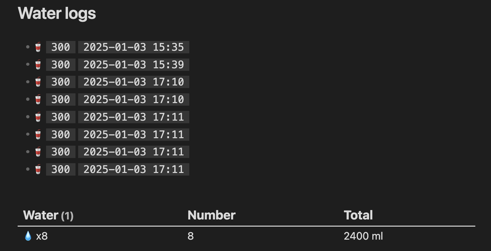

# Water Tracker plugin

## Overview

The purpose of this [Obsidian](https://obsidian.md) plugin is to help you keep track of how much water you drink on a daily basis. The plugin is customisable through a number of configurations, but mainly these are related to the size of the device used to drink and where to save the amount you drink.

## Features

- By means of a specific command or by clicking on an icon in the ribbon bar (if enabled and customisable), it is possible to increase the water-drinking counter
- The size of the glass/cup/whatever can be used for drinking can be specified in the given configuration
- You can choose where to save the total amount of water drunk:
  - Using a property with the total count in the current file
  - Using a property with the total count in the daily file
  - Adding a drink event log to the current file
  - Adding a drink-related event log to the daily file 


If the storage method used is log file, the logs can be summirized by using `dataviewjs` like this:

```js
const file = dv.current();

// Check if the file exists for today
if (file && file.file.lists) {
    const emoji = "💧";

    // Create a table to display total water drunk today
    dv.table(
        ["Water", "Number", "Total"], 
        file.file.lists
            .filter((item) => item.time && item.water !== undefined) // Ensure items have time and water defined
            .groupBy((item) => {
                const date = item.time.length >= 10 ? item.time.substring(0, 10) : "Unknown Date";
                return date;
            })
            .map((group) => {
                const waterCount = group.rows.length;
                let sum = 0;

                // Sum up the water
                group.rows.forEach((row) => {
                    if (typeof row.water === "number") sum += row.water; // Ensure water is numeric
                });

                // Display water consumption
                const waterDisplay = waterCount > 5 ? `${emoji} x${waterCount}` : emoji.repeat(waterCount);

                return [waterDisplay, waterCount, `${sum} ml`];
            })
    );
} else {
    dv.paragraph("No water found for today.");
}
```

resulting in:




## Contributing

Contributions are welcome! Feel free to submit a pull request or report issues.

1. Fork this repository.
2. Create a branch (`git checkout -b feature/your-feature`).
3. Commit your changes (`git commit -am 'Add your feature'`).
4. Push to the branch (`git push origin feature/your-feature`).
5. Open a pull request.

### How to run

- Clone this repo.
- Make sure your NodeJS is at least v16 (`node --version`).
- `npm i` or `yarn` to install dependencies.
- `npm run dev` to start compilation in watch mode.

## License

This project is licensed under the MIT License. See the [LICENSE](LICENSE) file for details.

---

If you encounter any bugs or have suggestions for new features, feel free to open an issue or contribute!
